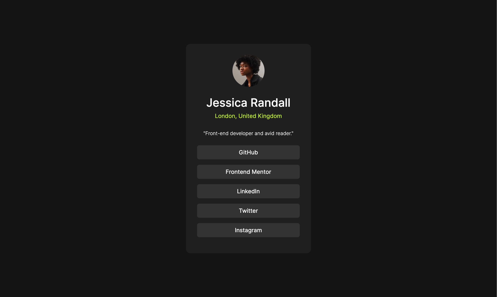

# Frontend Mentor - Social links profile solution

This is a solution to the [Social links profile challenge on Frontend Mentor](https://www.frontendmentor.io/challenges/social-links-profile-UG32l9m6dQ). Frontend Mentor challenges help you improve your coding skills by building realistic projects. 

## Table of contents

- [Overview](#overview)
  - [Screenshot](#screenshot)
  - [Links](#links)
- [My process](#my-process)
  - [Built with](#built-with)
  - [What I learned](#what-i-learned)
- [Author](#author)

## Overview

### Screenshot

### Links

- Solution URL: [Frontend Mentor Solution](https://github.com/tea-leaves00/Social-Links-Profile)
- Live Site URL: [Live Site](https://your-live-site-url.com)

## My process

### Built with

- Semantic HTML5 markup
- CSS custom properties
- Flexbox
- Mobile-first workflow

### What I learned

I continue to sharpen my flexbox skills as well as learning about which elements are best used for which styles. For example I was originally putting styles such as font family and background color on main, but decided body was a more appropriate choice. I also learned about active states and pseudo classes such as :hover.

## Author

- Frontend Mentor - [@tea-leaves00](https://www.frontendmentor.io/profile/tea-leaves00)

